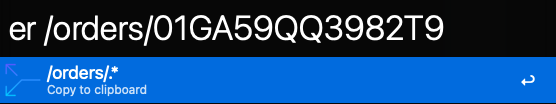

# Alfred path to regex

Alfred workflow to convert path to regex.  
Useful for searching for endpoints in IDEs.

### Install

    npm install --global @hoto/alfred-path-to-regex

### Example

Converts any parts of the path to `.*` only if:
* if part contains any of: `{`, `:`, `%s`, `0-9` 
* if part is all caps

### Develop

Create symlink for rapid workflow development:

    npm install --location=global

Publish:

    git commit -am "Commit message"
    npm version patch
    npm publish --access public

<a href="https://www.flaticon.com/free-icons/path" title="path icons">Path icons created by Graphix Dxinerz - Flaticon</a>
